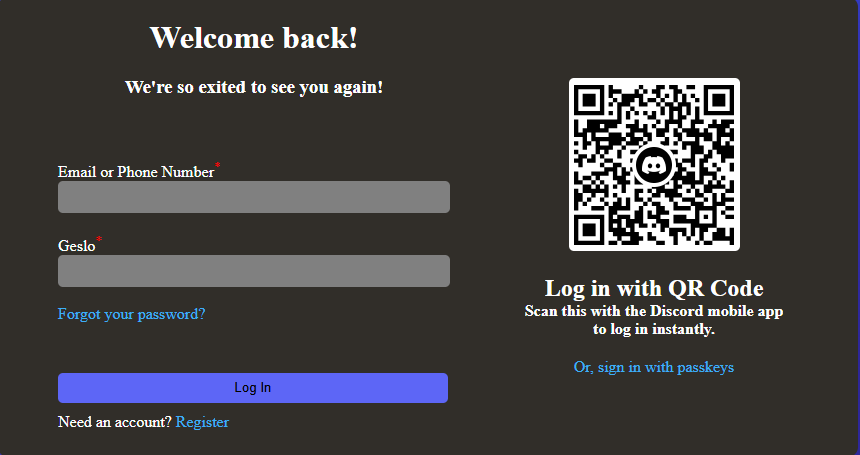

 
<h1></h1>Copy of Discord
h1>

These pages provide a simple, user-friendly authentication flow similar to Discord.
The Login Page allows users to sign in using email/phone and password, with helpful options like password visibility toggling, password recovery, and QR login.
The Account Creation Page lets new users register by entering basic details such as email, username, password, and date of birth, along with agreeing to required terms.
Both pages are lightweight, responsive, and enhanced with JavaScript for dynamic behavior.

##  Pages Included
- Login Page

- Email/phone input

- Password input with visibility toggle

- “Forgot password?” link

- QR code login option

- Login button

- Link to create a new account

- Uses code1.js for interactions

## Account Creation Page

- Fields for:

- Email

- Display name

- Username

- Password

- Date of birth

- Required agreement to:

- Terms of Service

- Optional email updates subscription

- “Create Account” button

- Link back to login page

- Uses code.js for form validation and dropdown behavior

##  General Notes

- Both pages follow a simple, responsive layout focused on user experience.

- SweetAlert2 is included for future use but not yet implemented.

- Pages can be easily expanded with backend authentication or API integration.

 ##  Successful log in
 - user: teja.marc@tscng.org
 - password: sola12
 
